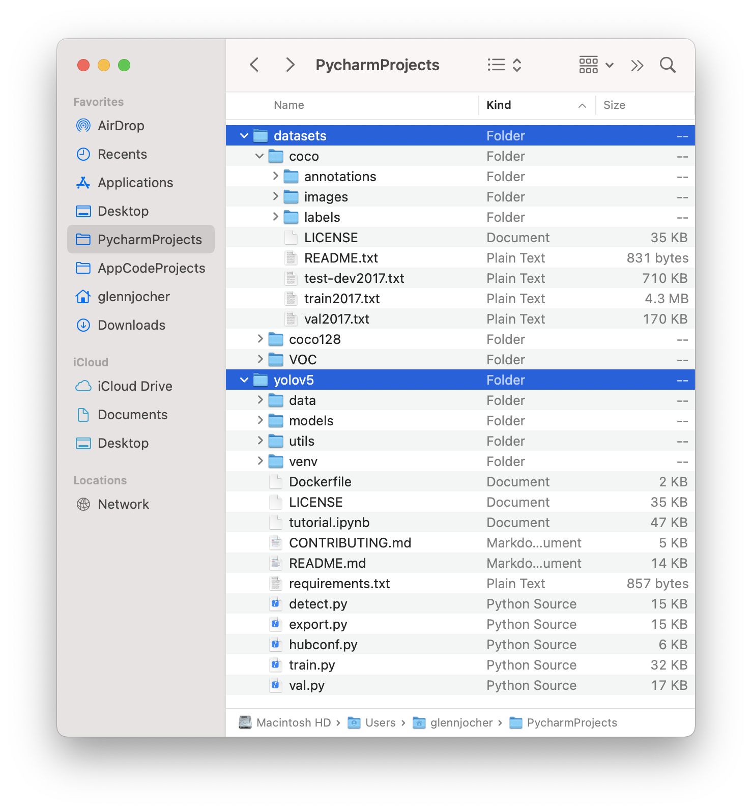
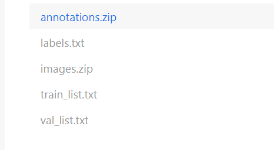
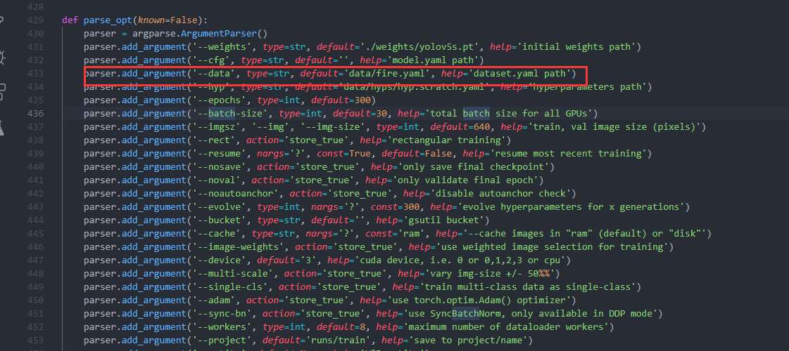

# yolov5-smoke-detection-python
A Python implementation of Yolov5 to detect whether peaple smoking in Jetson Xavier nx and Jetson nano
In Jetson Xavier Nx, it can achieve 33 FPS.

You can see video play in [BILIBILI](https://www.bilibili.com/video/BV1eY411x7k9/), or [YOUTUBE]().

if you have problem in this project, you can see this [CSDN artical](https://blog.csdn.net/weixin_42264234/article/details/121325030).

If you want to try to train your own model, you can see [yolov5-smoke-detection-python](https://github.com/RichardoMrMu/yolov5-smoke-detection-python). Follow the readme to get your own model.


# Dataset

https://pan.baidu.com/s/1vmjV1HwhcMOdUqFhKwH4Mg
提取码：pqsv

## Data
This pro needs dataset like 
```
../datasets/coco128/images/im0.jpg  #image
../datasets/coco128/labels/im0.txt  #label
```



Download the dataset and unzip it. 



```shell
unzip annnotations.zip
unzip images.zip
```
You can get this.
```
 ├── dataset
	├── annotations
  │   ├── mask_000001.xml
  │   ├── mask_000002.xml
  │   ├── mask_000003.xml
  │   |   ...
  ├── images
  │   ├── mask_000001.jpg
  │   ├── mask_000003.jpg
  │   ├── mask_000003.jpg
  │   |   ...
  ├── label_list.txt
  ├── train.txt
  └── valid.txt
```
You should turn xml files to txt files. You also can see [this](https://github.com/ultralytics/yolov5/wiki/Train-Custom-Data
). 
Open `script/sw2yolo.py`, Change `save_path` to your own save path,`root` as your data path, and `list_file` as `val_list.txt` and `train_list.txt` path.

```Python
list_file = "./val_list.txt"
xmls_path,imgs_path = get_file_path(list_file)

# 将train_list中的xml 转成 txt， img放到img中
save_path = './data/yolodata/smoke/cocolike/val/'
root = "./data/yolodata/smoke/"
train_img_root = root 
```

Then you need `script/yolov5-split-label-img.py` to split img and txt file.


```shell
mkdir images
mkdir lables
mv ./train/images/* ./images/train
mv ./train/labels/* ./labels/train
mv ./val/iamges/* ./images/val
mv ./val/lables/* ./lables/val
```

Finally You can get this.
```
 ├── cocolike
	├── lables
  │   ├── val 
  │       ├── smoke_000001.xml
  |       ├──   ...
  │   ├── train
  │       ├── smoke_000002.xml
  |       ├──   ...
  │   
  ├── images
  │   ├── val 
  │       ├── smoke_000001.jpg
  |       ├──   ...
  │   ├── train
  │       ├── smoke_000003.jpg
  |       ├──   ...
  ├── label_list.txt
  ├── train.txt
  └── valid.txt
```
## Datafile
`{porject}/yolov5/data/` add your own yaml files like `smoke.yaml`.
```yaml
# YOLOv5 🚀 by Ultralytics, GPL-3.0 license
# COCO128 dataset https://www.kaggle.com/ultralytics/coco128 (first 128 images from COCO train2017)
# Example usage: python train.py --data coco128.yaml
# parent
# ├── yolov5
# └── datasets
#     └── coco128  downloads here


# Train/val/test sets as 1) dir: path/to/imgs, 2) file: path/to/imgs.txt, or 3) list: [path/to/imgs1, path/to/imgs2, ..]
path: /home/data/tbw_data/face-dataset/yolodata/smoke/cocolike/  # dataset root dir
train: images/train  # train images (relative to 'path') 128 images
val: images/val  # val images (relative to 'path') 128 images
test:  # test images (optional)

# Classes
nc: 1  # number of classes
names: ['smoke']  # class names
```

# Train
Change `{project}/train.py`'s data path as your own data yaml path.

Change `batch-size ` as a suitable num. Change device if you have 2 or more gpu devices.
Then 

```shell
python train.py
```

# Test
Use `detect.py` to test.

```shell
python detect.py --source ./data/yolodata/mask/cocolike/images --weights ./runs/train/exp/weights/best.pt
```
You can see `{project}/runs/detect/` has png results.


